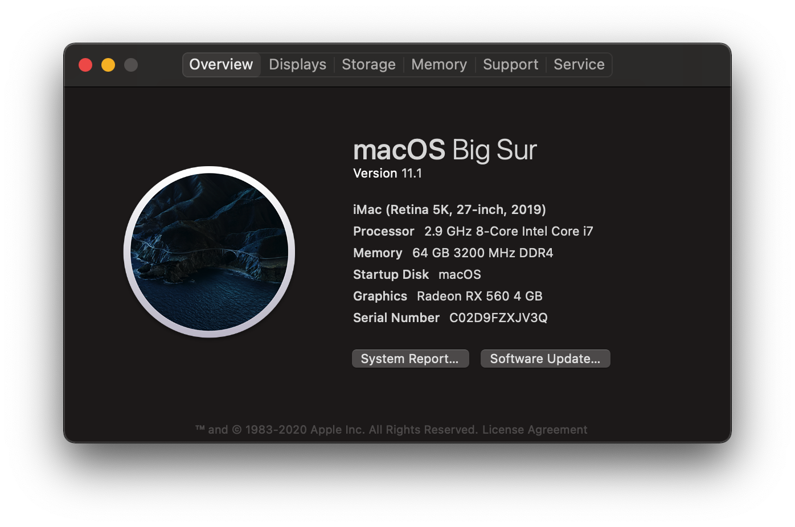

# OpenCore Bootloader ASRock-Z490M-ITX-ac

OpenCore 0.6.5

Guide used [OpenCore Vanilla](https://khronokernel.github.io/Opencore-Vanilla-Desktop-Guide/), I highly suggest reading through all of it and going through and creating your own `config.plist` even if it's just to understand the inner workings of OpenCore. Directly copying my `config.plist` may not work if you do not have the exact components that I do.

This has been tested and is running on 10.14.x, 10.15.x, 11.x.

## Hardware

 - CPU: Intel i7 10700
 - Motherboard: ASRock-Z490M-ITX-ac
 - M2 Hard Disk: Samsung 970 EVO PLUS 1TB NVME M.2
 - Heat sink: NOCTUA NH-L9i热
 - GPU: RX 560
 - RAM: Corsair DDR4 3200 C16 64GB (32GB x2)
 - Chassis: 小喆优品A1 https://item.taobao.com/item.htm?id=613413381311
 - Power: Enhance ENP 300W Flex https://item.taobao.com/item.htm?id=551013103706
 - WiFI: BCM94360CS2 M.2 NGFF (replace onboard card) https://item.taobao.com/item.htm?id=564299101029

## links

 - https://khronokernel.github.io/Opencore-Vanilla-Desktop-Guide
 - https://www.asrock.com/mb/Intel/Z490M-ITXac/index.asp
 - https://github.com/rusty-bits/OC-tool

## Working

- iServices
- Audio
- airport and WiFi (replace onboard card to BCM94352z/DW1560)
